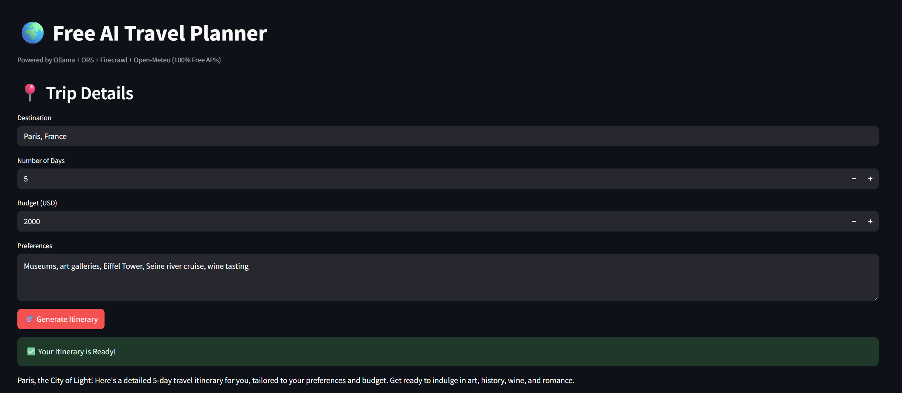
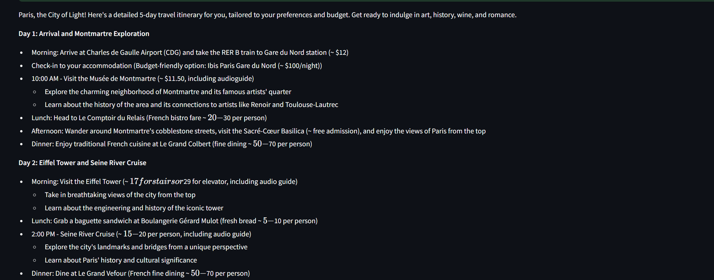
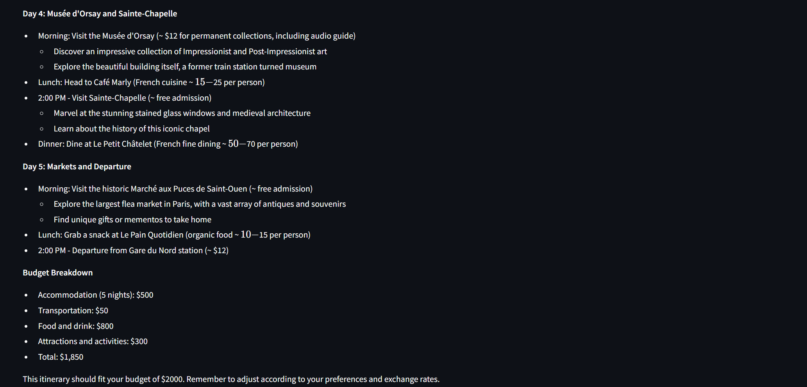

# ✈️ Local MCP AI Travel Planner

A **Streamlit-based AI travel planner** that generates **detailed, personalized itineraries** using **Ollama (local LLM)**, **Firecrawl**, and **OpenRouteService (ORS)**.

This project is built to run **fully locally and with free APIs** --- no OpenAI or paid services required.

## Demo Screenshot






---

## ✨ Features

### 🤖 AI-Powered Travel Planning

- Day-by-day itineraries with **timing, attractions, and activities**

- Personalized recommendations based on **budget & preferences**

- Runs **fully offline** with Ollama (no OpenAI needed)

### 🌐 Firecrawl Integration

- Scrapes attraction and travel websites for **real content**

- Extracts descriptions, opening hours, ticket prices

### 🗺️ ORS (OpenRouteService) Integration

- Free routing API

- Provides **distance and travel time calculations** between all locations

- Supports walking, driving, biking modes

### 📅 Additional Features

- Export itineraries as **`.ics` calendar files**

- Budget-conscious planning

- Fully customizable with your own Ollama model

---

## 🚀 Setup

### Requirements

- Python **3.9+**

- [Ollama](https://ollama.ai) installed locally

- [Firecrawl API key](https://firecrawl.dev)

- [ORS API key](https://openrouteservice.org/sign-up/)

### Installation

1. Clone this repository:

```bash

git clone https://github.com/your-username/mcp-local-travel-planner.git

cd mcp-local-travel-planner

```

2. Install dependencies:

```bash
pip install -r requirements.txt
```
3. Run the app:

```bash
streamlit run app.py
```

## 🎯 Usage

Start Ollama locally:

```bash
ollama run mistral
```

Run the app with Streamlit.

Enter your Firecrawl and ORS API keys in the sidebar.

Fill in trip details:

- Destination (e.g., Barcelona)

- Number of Days

- Budget (USD)

- Preferences (food, history, nightlife, etc.)

👉 The app will generate a complete travel itinerary with distances, timings, and tips.

## 🛠️ Troubleshooting

"Found 0 properties/attractions" → Website may have blocking, try a different URL or city.

ORS errors → Check your ORS API key is valid and enabled.

Ollama not found → Make sure Ollama is running before starting Streamlit.

## 📂 Project Structure

```bash
├── app.py # Main Streamlit app

├── requirements.txt # Python dependencies

└── README.md # Documentation
```

## 🧠 How It Works

- Ollama: Local LLM used for reasoning and itinerary generation

- Firecrawl: Crawls travel pages to extract content (attractions, descriptions)

- ORS: Calculates exact travel times & distances between itinerary stops

- Streamlit: Provides a clean UI

- iCalendar: Exports itinerary to .ics format

## 📌 Example Input

- Destination: Tokyo

- Days: 5

- Budget: $1500

- Preferences: Sushi, anime culture, temples, shopping

## 👉 Output

A 5-day Tokyo itinerary with real attraction details, metro travel times, food stops, cultural visits, and total budget estimation.

## 📢 Author

Built with ❤️ by Azar -- exploring AI agents for travel & real-world applications.
